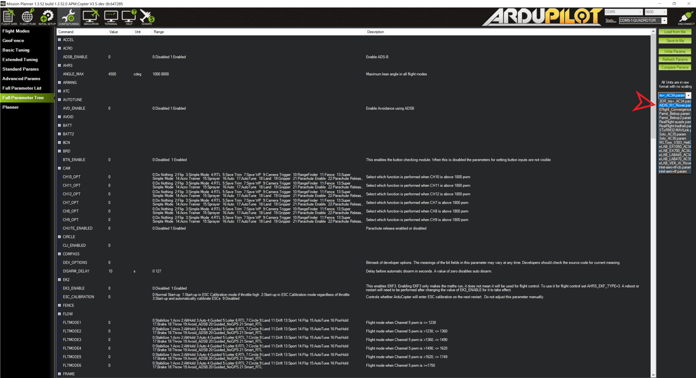

===============
Autopilot Setup
===============

1.	Hardware Setup:
-------------------

  1.1.	Install Autopilot module using the supplied screws and 4 holes located on the central chassis brace. (Ensure arrow is pointing toward the front of the rover)

..

  1.2.	**Connect Servo cables**

    1.2.1.	Autopilot “Main Out” Channel 1 -> Motor Controller “S1”

    1.2.2.	Autopilot “Main Out” Channel 3 -> Motor Controller “S2”

    1.2.3.	Autopilot RC IN -> FS-IA6B PPM/Channel 1

  1.3.	**Install Power Brick Between the Male/Female XT60 connectors located on the Battery Harness**

    1.3.1.	Using Power Cable, connect Power Brick -> Autopilot “Power1”

  1.4.	**Connect Buzzer to “USB” port on Autopilot**

  1.5.	**Connect GPS plug to “GPS1” port**

  1.6.	**Telemetry Connection**

- If using `[APSync] <http://ardupilot.org/dev/docs/apsync-intro.html>`_ or `[AIONio] <http://aionrobotics.com>`_ to stream Mavlink over wifi, connect the companion computer to the “Telem2” port.

- If using a long range telemetry radio such as RFD900, connect it to the “Telem1” port.

.. note:: - Telem1 is “Serial 1” under firmware parameters and set at 57600 Baud. - Telem2 is “Serial 2” under firmware parameters and set at 921600 Baud.
..

..

2.	Firmware Install:
---------------------

Due to popularity, we recommend using Mission Planner for Windows and Tower for Android GCS. However, there are other options available. For Example, QGround Control works on Windows, Mac, IOS, Linux & Android.

  1.	**Parameter File**

    1.1.	R1 Parameter files can be found on GitHub: `[ArduPilot Package] <https://github.com/ArduPilot/ardupilot/blob/master/Tools/Frame_params/AION_R1_Rover.param>`_

.. tip:: Unless you specifically need the Parameter file, you can automatically install it directly through Mission Planner as described below.
..

  2.	**Mission Planner GCS**

    2.1.	Download & Install Mission Planner `[HERE] <http://firmware.ardupilot.org/Tools/MissionPlanner/MissionPlanner-latest.msi>`_

    2.2.	Open Mission Planner

    2.3.	Ensure Autopilot module is not powered

    2.4.	Connect your computer to the Autopilot module via Micro USB

    2.5.	Select **“INITIAL SETUP”** tab

    2.6.	Select **“Install Firmware”** (You must have internet connection)

    2.7.	Select **“APM: Rover”** vehicle type and follow flashing instructions

  3.	**Load Parameter File**

    3.1.	Within Mission Planner, select the appropriate COM, Baud ``9600`` and click connect.

    3.2.	Select **“CONFIG/TUNING”** tab

    3.3.	Select **“Full Parameter Tree”**

    3.4.	Select **“AION_R1”** from the drop down window on the right

..

    3.5.	Click **"Load Presaved"**.

    3.6.	Select **“Check All"** & **"Continue”**

    3.7.  Select **"Write Params"**

    3.8.  Reboot the Pixhawk.
