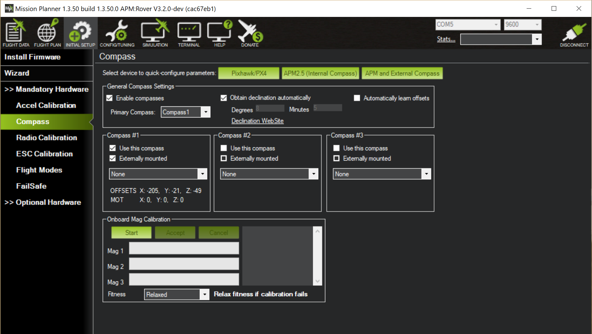

===========
Calibration
===========

1. Transmitter Calibration
--------------------------

  1.1.	Turn on Transmitter

  1.2.	Power on the R1 and connect to the GCS via wireless telemetry link.

  1.3.	Select the **“FLIGHT DATA”** tab and look in the HUD to ensure the vehicle is disarmed.

  1.4.	Select **“INITIAL SETUP”** tab

  1.5.	Select **“Mandatory Hardware”**

  1.6.	Select **“Radio Calibration”**

  1.7.	Select **“Calibrate Radio”** and follow instructions

.. tip:: Don’t forget to toggle your Fly Modes and Aux. Button to verify proper function.
..

  1.8.	Select the **“FLIGHT MODES”** tab and toggle **“Fly Mode 1 - MANUAL, 2 – GUIDED and 3 – AUTO”**. The corresponding mode should turn green upon activation.

2.	Accel Calibration
---------------------
  2.1.	Select **“Accel Calibration”** under the “INITIAL SETUP -> Mandatory Hardware” tabs.

  2.2.	Select **“Calibrate Accel”** and follow instructions

3.	Compass Calibration
-----------------------
  3.1.	Select **“Compass”** under the **“INITIAL SETUP -> Mandatory Hardware”** tabs.

  3.2.	Verify the settings are as pictured:

..

  3.3.	Find an outdoor area, clear of power lines and ferrous objects that will cause magnetic interference. (This includes metallic objects on your person)

  3.4.	Select “Start” in the “Onboard Mag Calibration” window and you will hear the Autopilot beep to signal calibration has started. (This will not work if the rover is Armed/Safety off)

  3.5.	To begin calibration, you must pick the rover up and spin it 360 degrees around each axis until the green bar next to “Mag 1” shows full and the GCS alerts you of a successful calibration.

.. caution:: Be careful not to drop the rover! You may want to enlist the help of another person!
..

.. tabularcolumns:: |c|c|c|

+--------------------+-------------+
|Chassis Orientation | Rotate      |
+====================+=============+
| Level, Tires Down  | 360 Degrees |
+--------------------+-------------+
| Left Side Up       | 360 Degrees |
+--------------------+-------------+
| Right Side Up      | 360 Degrees |
+--------------------+-------------+
|Front Up            | 360 Degrees |
+--------------------+-------------+
|Front Down          | 360 Degrees |
+--------------------+-------------+
|Level, Tires Up     | 360 Degrees |
+--------------------+-------------+
