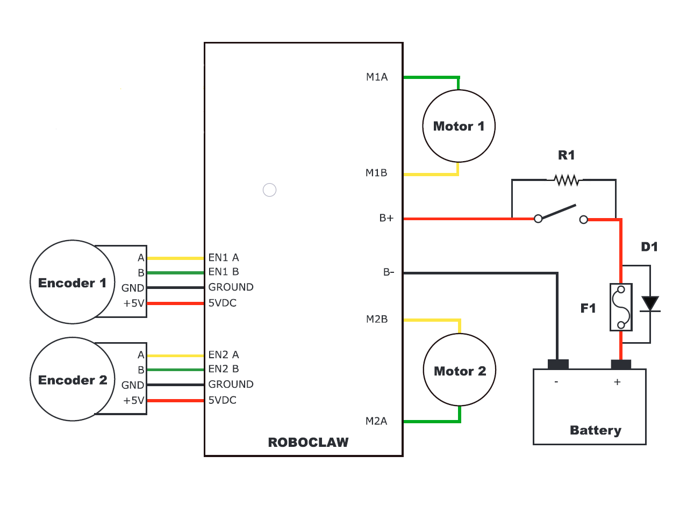

======================
Motor Controller Setup
======================

1.	Hardware Setup:
-------------------

.. image:: ../images/controller-wiring.jpg
    :width: 500
    :align: center

.. note:: Encoders are optional, they are not required for proper autopilot function.

2.	Firmware Setup:
-------------------

  2.1.	Download and install the “Ion Studio Setup Application” from `[HERE] <http://downloads.ionmc.com/software/IonStudio/setup.exe>`_
  ..

  2.2.	Power the motor controller by plugging in and powering on the smart battery.

.. note:: The smart battery has a low current cutoff feature. To maintain minimum current requirements, the Pixhawk and GPS sensor must be plugged in.
..

  2.3.	Connect your computer to the motor controller via Micro USB port.

.. note:: The RoboClaw driver does not pull power from its USB port.
..

  2.4.	Open the Ion Studio Application and select **"Connect Selected Unit"**

  2.5.	Under the General Setting tab select **"Control Mode"**

    2.5.1.	 Select **"R/C Mode"**

    2.5.2.	 Place the R1 on a stand to ensure the tires can spin safely.

    2.5.3.	 Under the **PWM Settings"** tab, slide the motor slider up to spin the motors forward. Check the encoder value boxes at the top of the screen to ensure the numbers are INCREASING in value.

.. tip:: If one or both numbers are counting backwards, simply reverse the effected encoders yellow & green wires.
..

      2.5.4.	 Select **"Device"** tab

      2.5.5.	 Select **"Save Settings"**

.. note:: For in-depth Firmware/Hardware setup guidelines please refer to the complete user manual located `[HERE] <http://downloads.ionmc.com/docs/roboclaw_user_manual.pdf>`_
