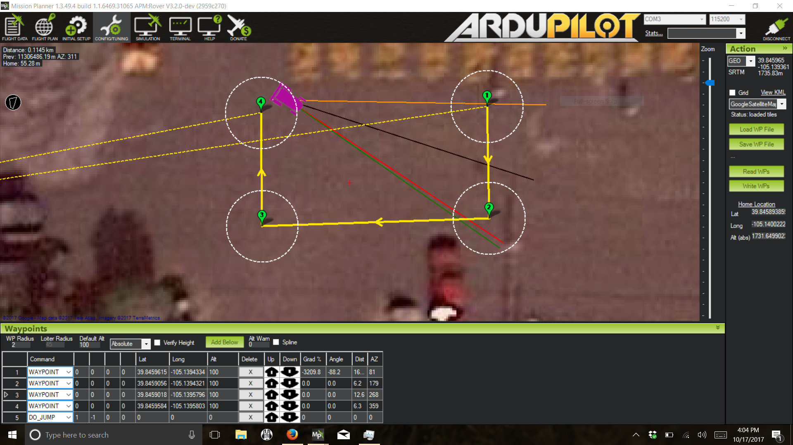

=========
Operation
=========

You should now be ready to test the R1!

.. note:: For GPS equipped rovers, upon booting the system, your rover will attempt to acquire a satellite lock as well as check magnetic health. When satellite lock is achieved, ArduPilot automatically marks its location as “Home” as can be seen in the “FLIGHT PLAN” tab in your GCS. (This can be moved manually)

.. tip:: To ensure stable operation and prevent error messages, do not operate your rover near tree’s or tall buildings/structures which can block LOS to GPS satellites, nor large metallic objects which can cause magnetic interference.

1.	Booting The System
----------------------

  1.1.	Turn on the Transmitter

  1.2.	Turn on the rover

  1.3.	The rover will boot into **“Safe Mode”** (Transmitter input is ignored)

  1.4.	Wait for the Autopilot tone to complete and achieve GPS lock (Signaled by Solid GREEN Status LED and flashing RED LED around the Safety Button)

  1.5.	If equipped with wireless telemetry, connect your GCS to the autopilot.

2.	Manual Control
------------------
  2.1.	Press and hold the **“Safety Button”** while ensuring Transmitter sticks are centered.

  2.2.	The Flashing RED LED will turn SOLID signally **“Safety Off”**

  2.3.	 Carefully use the transmitter to move the rover and verify that the direction of travel is correctly matched to the appropriate stick command.

3.	Sample Autonomous Mission
-----------------------------

  3.1.	While connected to the rover, select the **“FLIGHT PLAN”** tab within the GCS

  3.2.	If the GCS host device is connected to the internet, a map will display showing your rovers current position and “Home” position

  3.3.	Click on the map to draw a four waypoint mission as shown in the example:

..

  3.4.	For each waypoint you’ll see a corresponding command line populate under the **“Waypoints”** header

  3.5.	Click **“Add Below”** to add a new, blank, #5 Waypoint

  3.6.	Under **“Waypoint 5”** select the **“Command”** drop down list and choose “DO_JUMP”

  3.7.	In the box to the right, type **“1”** for Waypoint 1

  3.8.	In the following box type **“-1”** to designate the amount of times to repeat the mission

.. note:: The -1 input causes an endless loop condition. If you want the mission to repeat only 3 times, replace -1 with 3. If you do not add the Waypoint 5 command, the mission will end when it reaches waypoint 4.
..

  3.9.	Select **“Write WPs”** to write the mission to the Autopilot module

  3.10.	To start the mission, turn off the Safety Switch and toggle your transmitter to **“Mode 3 – Auto”**

.. tip:: Returning to **“Mode 1 – Manual”** will instantly stop the mission. Loss of transmitter signal will trigger a **“Hold”** failsafe condition until signal is returned.

.. tip:: When starting a mission, the rover will travel to each waypoint in consecutive order. Once it achieves Waypoint 4, the DO_JUMP command tells the rover to “Jump” back to “Waypoint 1” (signified in the box to the right) and to repeat this command as many times as listed in the following box.
