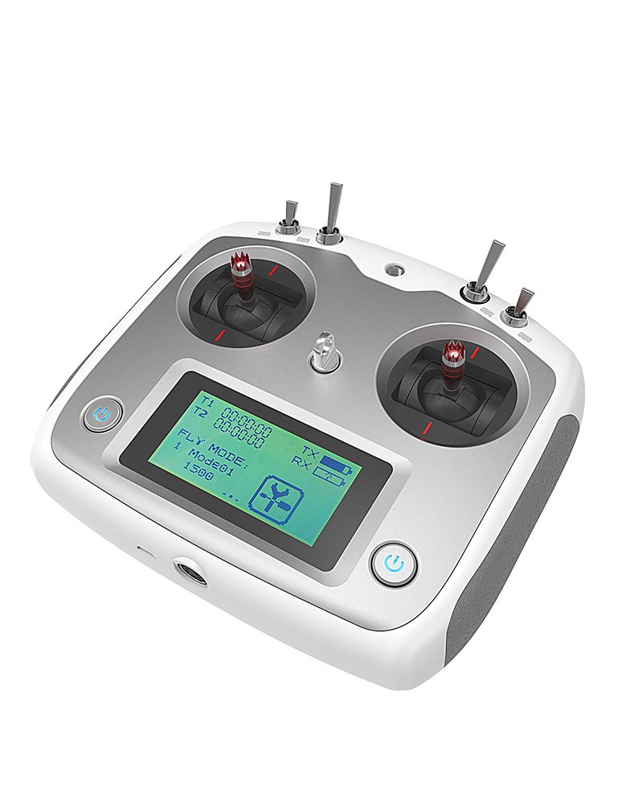

========================
Transmitter and Receiver
========================

The included FrySky i6S transmitter and FS-IA6B receiver come pre-bound from the factory but you will need to perform the following setup procedure to ensure proper functioning with ArduRover firmware/Parameter list.

.. tabularcolumns:: |c|c|c|

+---------------------------+-------+
|Function                   |Channel|
+===========================+=======+
| Throttle                  | 3     |
+---------------------------+-------+
| Roll                      | 1     |
+---------------------------+-------+
| Mode Selection            | 5     |
+---------------------------+-------+
|Auxiliary Channel          | 7     |
+---------------------------+-------+

1.	Install four “AA” batteries into the Transmitter. (Not included)

2.	Ensure switches SWA, SWB, SWC and SWD are in the UP position and Receiver is OFF

3.	Turn on Transmitter by pressing and holding both power buttons.

4.	Setup – RX Output Mode
--------------------------

  4.1.	Press Setup button on the touch screen.

  4.2.	Select “SYS” or “SYSTEM” tab.

  4.3.	Select “Output mode”

  4.4.	Select “PPM” & “S.BUS”

  4.5.	Select back button

..

5.	Setup – Sticks Mode
-----------------------

  5.1.	Under the “SYSTEM” tab, select “Sticks Mode”

  5.2.	Select M1 as pictured

  5.3.	Select back button

  5.4.	Select back button to return to Home Screen

..

6.	Setup – “FLY MODE”
----------------------

  6.1.	From Home Screen, press “FLY MODE”

  6.2.	Setup “Manual Mode” as pictured:

..

  6.3.	Flip SWB to the CENTER position

  6.4.	Setup “Steer Mode” as pictured

..

  6.5.	Flip SWB to the LOWER position

  6.6.	Setup “Auto Mode” as pictured

..

  6.7.	Press back button to return to Home Screen

7.	On the Home Screen, verify each “FLY MODE” by moving SWB from UPPER, CENTER and LOWER position. (MODE 1: Manual, MODE 2: Steer, MODE 3: Auto)

..

8.	Setup – Auxiliary Button (Used to store Waypoint)
-----------------------------------------------------

  8.1.	Press Setup button on touch screen

  8.2.	Select “Aux. channels” under “FUNCTION” tab

  8.3.	Scroll to “Channel 7”

  8.4.	Select “Key 1” as pictured. (Left button on backside of controller)

  8.5.	Hit return button twice to return to home screen.

