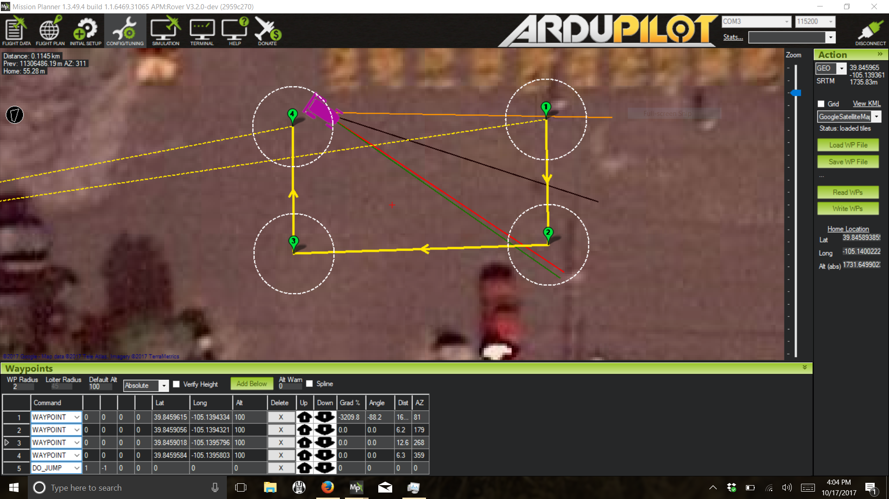

============
Tuning Guide
============

..

The Parameter file available for download from Aion Robotics provides a stable, parameter configuration and tune. However, to achieve optimal performance, you will need to adjust the tuning parameters to your specific needs and conditions.

  1.	Find a safe, open environment similar to your desired operating conditions and draw a rectangular, looped mission as illustrated in the previous “Sample Autonomous Mission” (Try to make the corners of the rectangle as perpendicular as possible)

  2.	Start the mission and watch the rover as it navigates the course. The goal is to tune the rover so it makes each turn without overshooting the bearing to the next waypoint as pictured. If the rover overshoots (Turns too far), you must dampen the steering, if it undershoots (Turns to wide), you must increase the steering rate. Adjusting the Waypoint radius is also helpful.

For in-depth tuning guide please visit the following links:
-----------------------------------------------------------

`[Speed & Throttle Tuning] <http://ardupilot.org/rover/docs/rover-tuning-throttle-and-speed.html>`_

`[Steering Rate Tuning] <http://ardupilot.org/rover/docs/rover-tuning-steering-rate.html>`_

`[Navigation Tuning] <http://ardupilot.org/rover/docs/rover-tuning-navigation.html>`_

`[Control Modes] <http://ardupilot.org/rover/docs/rover-control-modes.htmlv>`_
