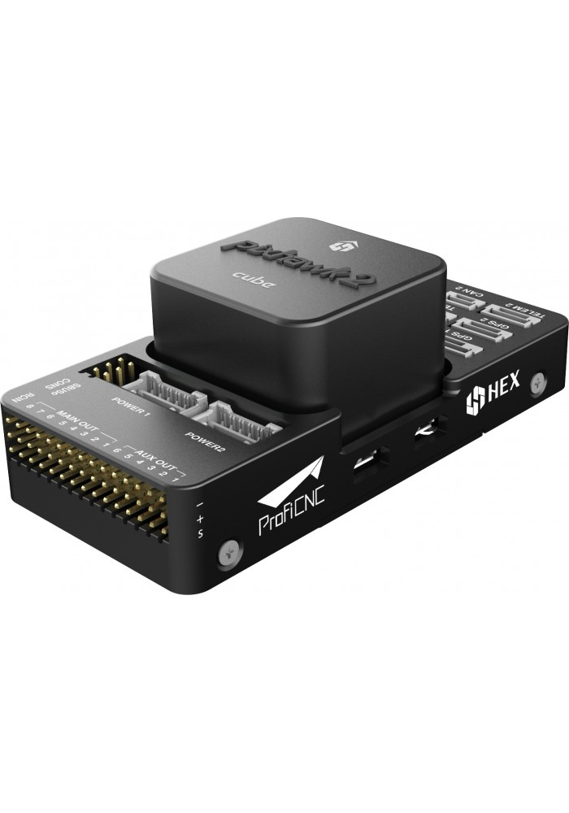

=======================
Autopilot Documentation
=======================

For purchasing please visit the Aion Robotics `Webstore. <https://www.aionrobotics.com/products>`_

Pixhawk 2.1 Autopilot Module
----------------------------

..

The Pixhawk 2.1 is the most advanced civilian grade autopilot module in the world.

**Specifications:**

-  **Processor**

   -  32-bit ARM Cortex M4 core with FPU
   -  168 Mhz/256 KB RAM/2 MB Flash
   -  32-bit failsafe co-processor

-  **Sensors**

   -  Three redundant IMUs (accels, gyros and compass)
   -  InvenSense MPU9250, ICM20948 and/or ICM20648 as first and third IMU (accel and gyro)
   -  ST Micro L3GD20+LSM303D or InvenSense ICM2076xx as backup IMU (accel and gyro)
   -  Two redundant MS5611 barometers

-  **Power**

   -  Redundant power supply with automatic failover
   -  Servo rail high-power (7 V) and high-current ready
   -  All peripheral outputs over-current protected, all inputs ESD
      protected

-  **Interfaces**

   -  14x PWM servo outputs (8 from IO, 6 from FMU)
   -  S.Bus servo output
   -  R/C inputs for CPPM, Spektrum / DSM and S.Bus
   -  Analogue / PWM RSSI input
   -  5x general purpose serial ports, 2 with full flow control
   -  2x I2C ports
   -  SPI port (un-buffered, for short cables only not recommended for use)
   -  2x CAN Bus interface
   -  3x Analogue inputs (3.3V and 6.6V)
   -  High-powered piezo buzzer driver (on expansion board)
   -  High-power RGB LED (I2C driver compatible connected externally only)
   -  Safety switch / LED
   -  Optional carrier board for Intel Edison

- `Datasheet <http://www.hex.aero/wp-content/uploads/2016/07/DRS_Pixhawk-2-17th-march-2016.pdf>`_

- `Quick Start Guide <http://www.hex.aero/wp-content/uploads/2016/09/PIXHAWK2-Assembly-Guide.pdf>`_

- `DF17 (Cube connector) Info <http://www.hex.aero/wp-content/uploads/2016/12/DF17_catalog-1.pdf>`_

​Here & Here+ GPS
-----------------
- `Hardware Install Manual <http://www.hex.aero/wp-content/uploads/2016/12/Here-and-Here_MANUAL.pdf>`_

Here+ (M8P) RTK GPS
-------------------

- `Datasheet <http://www.hex.aero/wp-content/uploads/2017/01/Here-Datasheet.pdf>`_

- `User Manual <http://www.hex.aero/wp-content/uploads/2017/03/Here-Usage-Instruction.pdf>`_

- `Firmware Update Instructions <http://www.hex.aero/wp-content/uploads/2017/05/Here-RTK-GNSS-firmware-v1.3-update-instruction.pdf>`_

​
