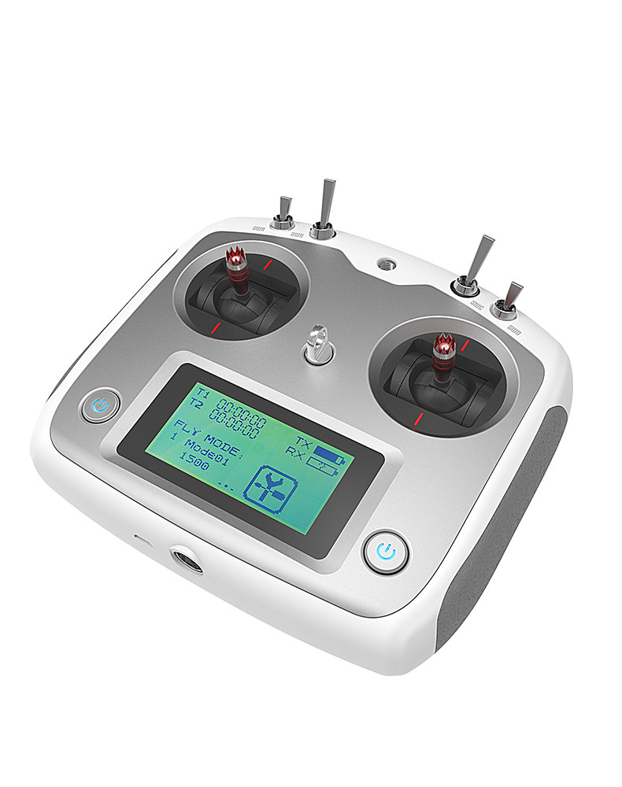

========================
Transmitter and Receiver
========================

The included FrySky i6S transmitter and FS-IA6B receiver come pre-configured from AION ROBOTICS.

.. tabularcolumns:: |c|c|c|

+---------------------------+-------+
|Function                   |Channel|
+===========================+=======+
| Roll                      | 1     |
+---------------------------+-------+
| Pitch                     | 2     |
+---------------------------+-------+
| Throttle                  | 3     |
+---------------------------+-------+
| Yaw                       | 4     |
+---------------------------+-------+
| Mode Selection            | 5     |
+---------------------------+-------+
|Auxiliary Channel          | 7     |
+---------------------------+-------+

.. tabularcolumns:: |c|c|c|

+------------+-----------+------------+----------------+--------------------+
| Switch     | Position  | Switch     | Position       | Mode/Function      |
+============+===========+============+================+====================+
| SWA        | UP        | SWB        | UP             | ALTITUDE HOLD      |
+------------+-----------+------------+----------------+--------------------+
| SWA        | UP        | SWB        | MIDDLE         | LOITER             |
+------------+-----------+------------+----------------+--------------------+
| SWA        | UP        | SWB        | DOWN           | AUTO               |
+------------+-----------+------------+----------------+--------------------+
| SWA        | DOWN      | SWB        | UP             | ALTITUDE HOLD      |
+------------+-----------+------------+----------------+--------------------+
| SWA        | DOWN      | SWB        | MIDDLE         | GUIDED             |
+------------+-----------+------------+----------------+--------------------+
| SWA        | DOWN      | SWB        | DOWN           | RTL                |
+------------+-----------+------------+----------------+--------------------+
| SWD        | UP        |            |                | LANDING GEAR DOWN  |
+------------+-----------+------------+----------------+--------------------+
| SWD        | DOWN      |            |                | LANDING GEAR UP    |
+------------+-----------+------------+----------------+--------------------+

.. raw:: html

   <table border="1" class="docutils">
   <tr><th>Mode</th><th>Alt Ctrl</th><th>Pos Ctrl</th><th>GPS</th><th>Summary</th></tr>
   <tr><td>Alt Hold</td><td>s</td><td>+</td><td></td><td>Holds altitude and self-levels the roll & pitch</td></tr>
   <tr><td>Auto</td><td>A</td><td>A</td><td>Y</td><td>Executes pre-defined mission</td></tr>
   <tr><td>Guided</td><td>A</td><td>A</td><td>Y</td><td>Navigates to single points commanded by GCS</td></tr>
   <tr><td>Loiter</td><td>s</td><td>s</td><td>Y</td><td>Holds altitude and position, uses GPS for movements</td></tr>
   <tr><td>RTL</td><td>A</td><td>A</td><td>Y</td><td>Retruns above takeoff location, may aslo include landing</td></tr>
   <tr><td>Simple/Super Simple</td><td></td><td></td><td>Y</td><td>An add-on to flight modes to use pilot's view instead of yaw orientation</td></tr>
   </table>

.. raw:: html

   <table border="1" class="docutils">
   <tr><th>Symbol</th><th>Definition</th></tr>
   <tr><td>-</td><td>Manual control</td><tr>
   <tr><td>+</td><td>Manual control with limits & self-level</td><tr>
   <tr><td>s</td><td>Pilot controls climb rate</td></tr>
   <tr><td>A</td><td>Automatic control</td></tr>
   </table>
