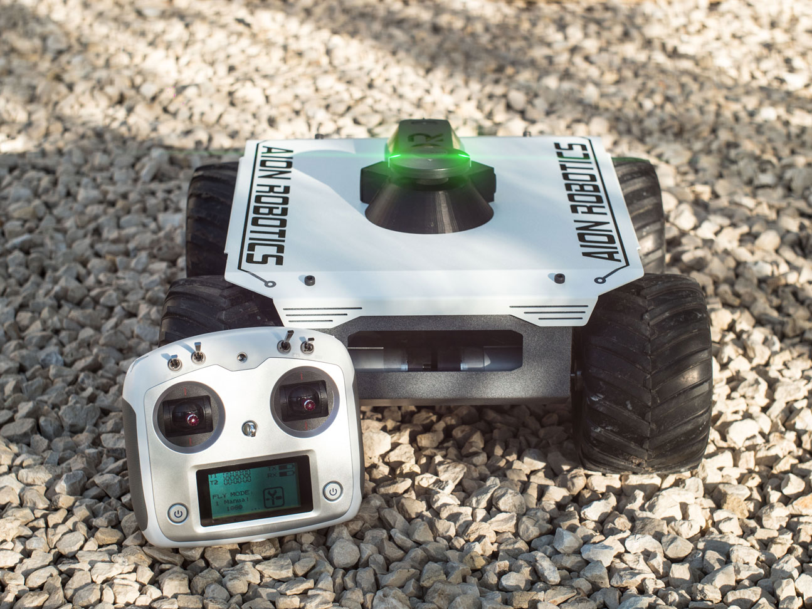
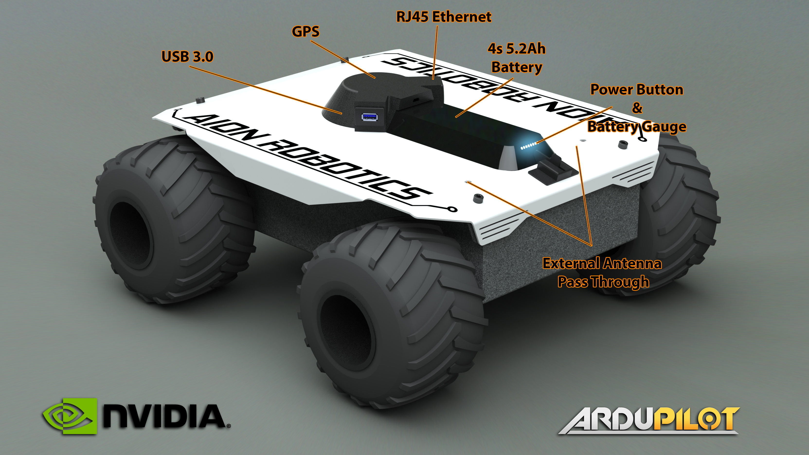
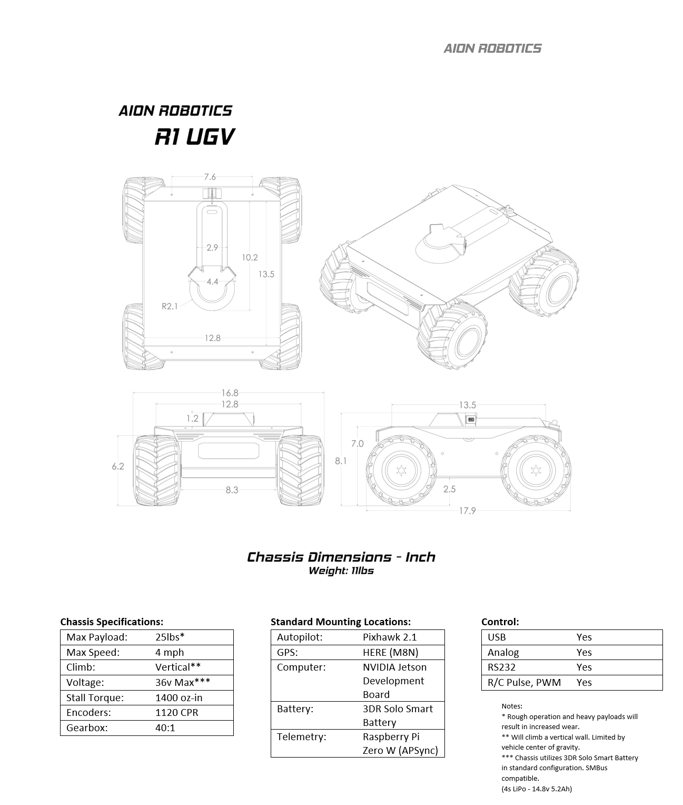
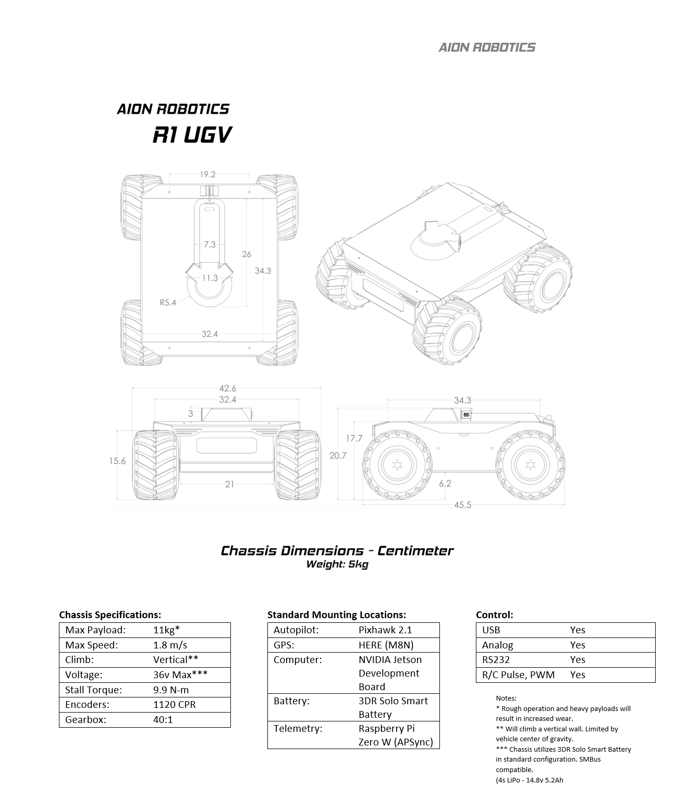

======
R1 UGV
======

Model Specifications
--------------------

Package Options
---------------

The Aion Robotics R1 UGV is a powerful turn-key 4x4 skid-steer rover designed from the ground up to meet the needs of students, enthusiasts and professional research & development teams alike.

A true indoor/outdoor capable robotics platform, its powder coated chassis is made from heavy gauge Aluminum and it rolls on 6" shock absorbing, foam filled tires.

This rover is so powerful its capable of a vertical wall climb given up to 7ft-lbs (9.5Nm) of torque thanks to four direct drive DC gear motors w/ encoders.

It weighs roughly 11lbs (5Kg) ready-to-run and comes with a front facing window to protect video gear as well as plenty of extra room for add on accessories.

Due to the highly modular nature of the platform, it can be utilized in
multiple configurations. The following pre-configured packages are available for purchase on the AION ROBOTICS webstore  `[HERE] <https://www.aionrobotics.com/products/>`_

.. tabularcolumns:: |c|c|c|

+-----------+-------------------+-------------------+-------------+
|Package    | Configuration     | Hardware          | Software    |
+===========+===================+===================+=============+
| ArduPilot | AutoPilot Control | Pixhawk 2.1       | ArduPilot   |
+-----------+-------------------+-------------------+-------------+
| ArduROS   | Hybrid Control    | - Pixhawk 2.1     | - ArduPilot |
|           |                   | - Jetson TX2      | - ROS       |
+-----------+-------------------+-------------------+-------------+

ArduPilot Edition
-----------------

The ArduPilot Edition leverages ArduPilot, the worlds leading Open Source autopilot software to manage platform tuning and basic autonomous control.

**Detailed ArduPilot Info:** `[HERE] <http://ardupilot.org/rover/index.html>`_

Using a Ground Control Station such as `[Mission Planner] <http://ardupilot.org/planner/>`_ users can easily build GPS based waypoint missions, view real time telemetry data, control servo's and access all sensors without writing a single line of code. Users will also enjoy support for features like RTK and indoor positioning, obstacle avoidance, camera gimbal control and cant script advanced missions if needed.

For control hardware, the ArduPilot package utilizes a Pixhawk 2.1, the most advanced civilian grade autopilot module in the world. It boasts top notch features such as a triple redundant power supply, heat stabilized, triple redundant IMU, M8N GPS sensor and on board real time processor. *Aion Robotics does not offer direct px4 support*

**Detailed Pixhawk 2.1 Info:** `[HERE] <http://www.hex.aero/?page_id=317>`_

.. tabularcolumns:: |c|c|c|

+---------------------------+---+
| ArduPilot Contents:       |Qty|
+===========================+===+
| Chassis                   | 1 |
+---------------------------+---+
| Wheels + Tires            | 4 |
+---------------------------+---+
| Motors + Encoders         | 4 |
+---------------------------+---+
|Motor Controller           | 1 |
+---------------------------+---+
|Encoder Cables             | 2 |
+---------------------------+---+
|Micro USB Port             | 1 |
+---------------------------+---+
|FlySky i6S Transmitter     | 1 |
+---------------------------+---+
|FlySky FS-IA6 Receiver     | 1 |
+---------------------------+---+
|R/C Servo Cables           | 3 |
+---------------------------+---+
|14.8V 5200Ah Smart Battery | 1 |
+---------------------------+---+
|Pixhawk 2.1 Autopilot      | 1 |
+---------------------------+---+
|HERE M8N GPS Module        | 1 |
+---------------------------+---+

ArduROS Edition
---------------

The ArduROS Edition comes fully configured and "ready-to-code" out of the box.

In this configuration the vehicle is equipped with a Pixhawk 2.1 Autopilot module running ArduPilot and a Jetson TX2 running ROS.

You get all the easy to use features of the ArduPilot Edition UGV plus the ability to put ArduPilot in a "slave" mode utilizing ROS for advanced control and sensor integration projects.

Running the latest release of JetPack, you'll have access to a full Ubuntu desktop and all the great features of linux. Whether developing Simultaneous Localization and Mapping applications, Deep Neural Networks, Object Detection and Tracking, the `AIONio <https://docs.aionrobotics.com/en/dev_branch/aionio.html>`_ package will serve as an excellent foundation to get you going quickly.

**Features:**

- TensorRT

- cuDNN

- VisonWorks/OpenCV

- CUDA

- Multimedia API

- L4T

- Development Tools

**Detailed Jetson Module Info:** `[HERE] <https://www.nvidia.com/en-us/autonomous-machines/embedded-systems/>`_

**Detailed JetPack Info:** `[HERE] <https://developer.nvidia.com/embedded-computing>`_

.. tabularcolumns:: |c|c|c|

+------------------------------+---+
|ArduROS Contents              |Qty|
+==============================+===+
| Chassis                      | 1 |
+------------------------------+---+
| Wheels + Tires               | 4 |
+------------------------------+---+
| Motors + Encoders            | 4 |
+------------------------------+---+
|Motor Controller              | 1 |
+------------------------------+---+
|Encoder Cables                | 2 |
+------------------------------+---+
|Micro USB Port                | 1 |
+------------------------------+---+
|USB 3.0 Port                  | 1 |
+------------------------------+---+
|RJ45 Ethernet Port            | 1 |
+------------------------------+---+
|External Antenna Kit (2.4Ghz) | 1 |
+------------------------------+---+
|NVIDIA Jetson TX2 Dev Kit     | 1 |
+------------------------------+---+
|FlySky i6S Transmitter        | 1 |
+------------------------------+---+
|FlySky FS-IA6 Receiver        | 1 |
+------------------------------+---+
|R/C Servo Cables              | 3 |
+------------------------------+---+
|14.8V 5200Ah Smart Battery    | 1 |
+------------------------------+---+
|Pixhawk 2.1 Autopilot         | 1 |
+------------------------------+---+
|HERE M8N GPS Module           | 1 |
+------------------------------+---+
