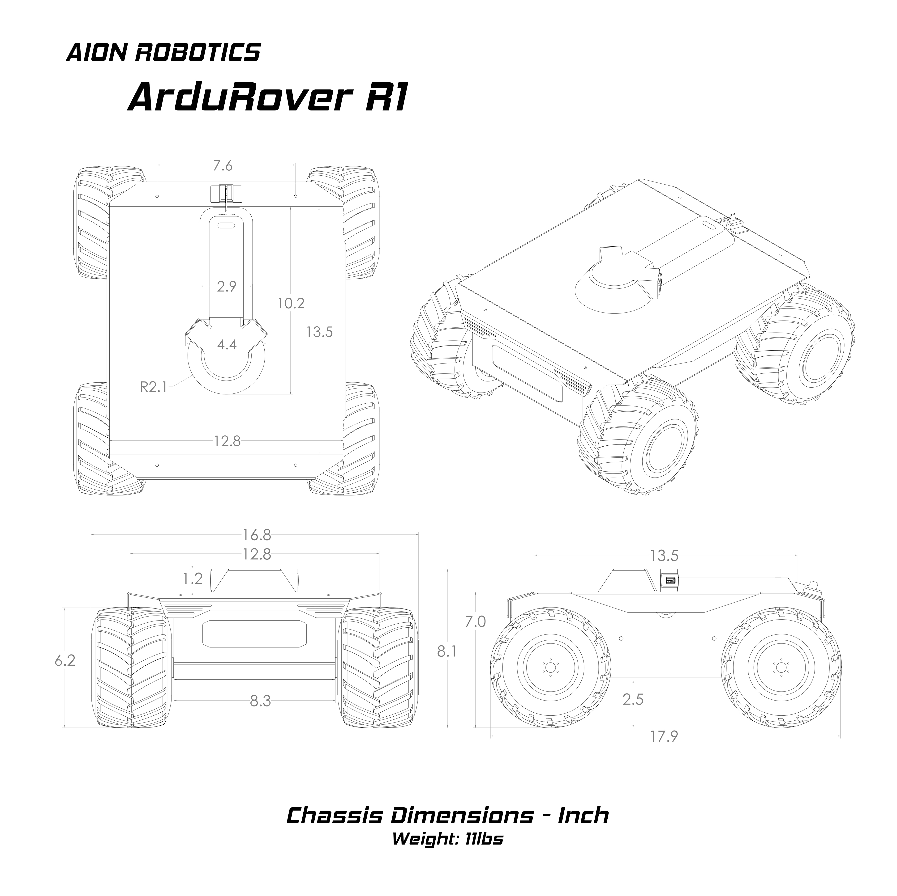
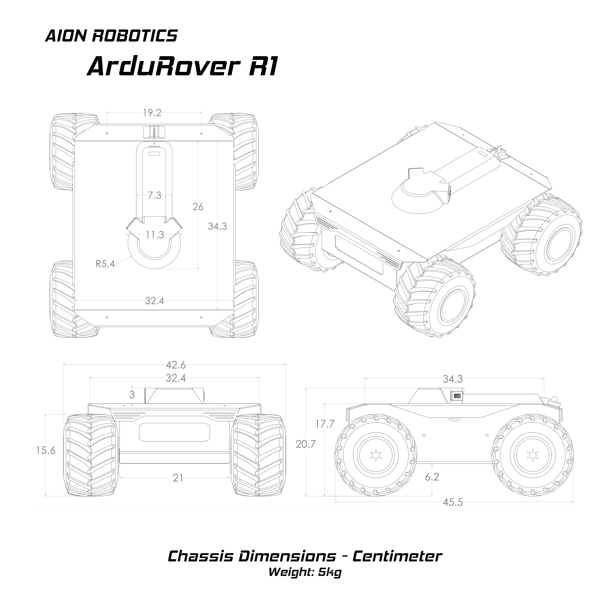

======
R1 UGV
======

Model Specifications
--------------------

.. image:: ../images/Aion-Robotics-R1-Gravel-Anamorphic-Flare-Front-25.jpg
    :width: 800
.. image:: ../images/R1Features.jpg
    :width: 800

Package Options
---------------

The Aion Robotics R1 UGV is a powerful turn-key indoor/outdoor capable rover designed from the ground up to meet the needs of students, enthusiasts and professional research & development teams alike.

Due to the highly modular nature of the platform, it can be utilized in
multiple configurations. The following pre-configured packages are available for purchase on the Aion Robotics webstore  `[HERE] <https://www.aionrobotics.com/products/>`_

.. tabularcolumns:: |c|c|c|

+-----------+-------------------+-------------------+-------------+
|Package    | Configuration     | Hardware          | Software    |
+===========+===================+===================+=============+
| ArduPilot | AutoPilot Control | Pixhawk 2.1       | ArduPilot   |
+-----------+-------------------+-------------------+-------------+
| ROS       | Computer Control  | Jetson TX2        | ROS         |
+-----------+-------------------+-------------------+-------------+
| ArduROS   | Hybrid Control    | - Pixhawk 2.1     | - ArduPilot |
|           |                   | - Jetson TX2      | - ROS       |
+-----------+-------------------+-------------------+-------------+

ArduPilot Package
-----------------

The ArduPilot package leverages ArduPilot, the worlds leading Open Source autopilot software to manage platform tuning and basic autonomous control.

**Detailed ArduPilot Info:** `[HERE] <http://ardupilot.org/rover/index.html>`_

Using a Ground Control Station such as `[Mission Planner] <http://ardupilot.org/planner/>`_ users can easily build GPS based waypoint missions, view real time telemetry data, control servo's and access all sensors without writing a single line of code. Users will also enjoy support for features like RTK and indoor positioning, obstacle avoidance, camera gimbal control and cant script advanced missions if needed.

For control hardware, the ArduPilot package utilizes a Pixhawk 2.1, the most advanced civilian grade autopilot module in the world. It boasts top notch features such as a triple redundant power supply, heat stabilized, triple redundant IMU, M8N GPS sensor and an on board processor capable of running both ArduPilot and px4 firmwares. *Aion Robotics does not offer direct px4 support*

**Detailed Pixhawk 2.1 Info:** `[HERE] <http://www.hex.aero/?page_id=317>`_

ROS Package
-----------

The ROS Package is for those looking for a pure ROS controlled robot.

This package comes fully configured and "ready-to-code" out of the box. Spend time writing code, not engineering and/or trouble shooting your platform.

For control hardware, it comes equipped with NVIDIA's extremely powerful, energy efficient Jetson TX2 development kit which directly controls the onboard motor driver.

These modules represent the most advanced computing platform for AI "at the edge". Running the latest release of JetPack, you'll have access to a full Ubuntu desktop and all the great features of linux. Whether developing Simultaneous Localization and Mapping applications, Deep Neural Networks, Object Detection and Tracking, this ROS enabled package will serve as an excellent foundation to get you going quickly.

**Features:**

- TensorRT

- cuDNN

- VisonWorks/OpenCV

- CUDA

- Multimedia API

- L4T

- Development Tools

**Detailed Jetson Module Info:** `[HERE] <https://www.nvidia.com/en-us/autonomous-machines/embedded-systems/>`_

**Detailed JetPack Info:** `[HERE] <https://developer.nvidia.com/embedded-computing>`_

ArduROS Package
---------------

The best of both worlds, the ArduROS package comes with both Pixhawk 2.1 autopilot module running ArduPilot and the Jetson TX2 running ROS.

In this configuration, ArduPilot acts as the lower level control/failsafe layer of your system. You get all the excellent features of ArduPilot PLUS the Jetson TX2 running ROS in a companion computer configuration. This allows for advanced control of ArduPilot, sensor processing and scripting. (Lidar, stereo vision SLAM, Deep Learning etc)

Sensor data from the Pixhawk 2.1 (IMU, Encoders, GPS etc) are made available as ROS topics.

**Should the companion freeze, ArduPilot is your failsafe.**
