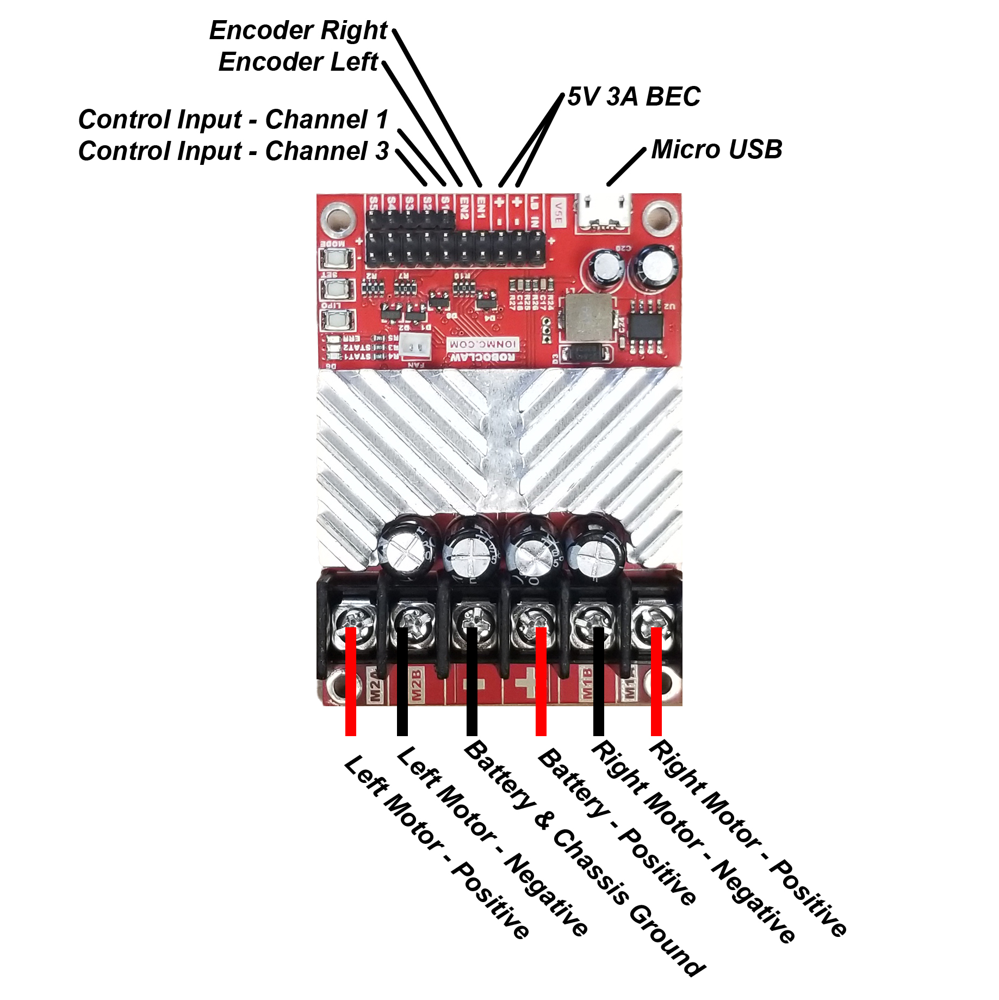
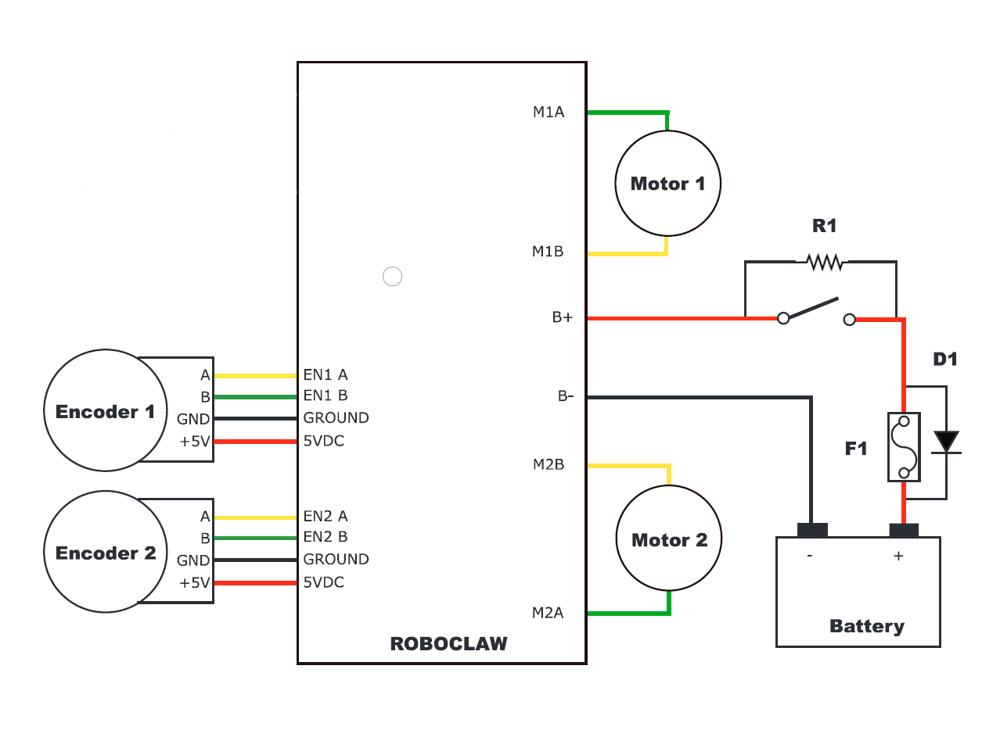

=======================
ROS Robot Configuration
=======================

.. note:: The R1 "ROS Package" ships "ready-to-code" with all hardware & software fully configured. The information provided below is for troubleshooting, educational or R1 upgrade purposes.

*Easy Button?* `[CLICK HERE] <>`_ *for instructions on flashing a complete, ready to run TX2 image.*

Jetson TX2 Requirements:
------------------------

1. The following prerequisites must be installed/setup on NVIDIA Jetson TX2

  [x] Ubuntu 16.04Lts

  [x] ROS Kinetic-*Desktop*

  [x] Package - "joy" (Installed for you if using the script)

  [x] Package - "teleop-twist-joy" (Installed for you if using the script)

  [x] Package - "joystick-drivers" (Installed for you if using the script)

  [x] Connection to the internet

  [x] Enable Bluetooth and trust/pair joystick device

Install JetPack on TX2
----------------------

Detailed instructions on the NVIDIA website `[HERE] <http://docs.nvidia.com/jetpack-l4t/2_1/content/developertools/mobile/jetpack/jetpack_l4t/2.0/jetpack_l4t_install.htm>`_

Rebuild Jetson TX2 Kernel
-------------------------
After Installing JetPack you must rebuild the Kernel to enable support for Serial USB ttyACM0. `[HERE] <https://github.com/aionrobotics/buildJetsonTX2Kernel>`_

.. note:: This step will be phased out upon the official release of JetPack 3.2

Install ROS on the TX2
----------------------
This includes the required packages and utilities. `[HERE] <https://github.com/aionrobotics/installROSTX2>`_

Joystick Setup
--------------

- Find Joystick:
::

  ls /dev/input

This will print a list of input devices. The Joystick will show up as ``jsX`` or, ``js0`` in our example.

- Test Joystick:
::

  jstest /dev/input/js0

Joystick readings will print to screen.
press ctrl-q to stop process

- Map Joystick to match ROS:
::

  gstest-gtk /dev/input/js0

.. tip:: If ssh into TX2 you must first export the display to your remote machine.

To do so:
::

  export DISPLAY=:10

**Sample button mapping for Playstation Navigation Controller:**

+---------------+--------+--------+
| Function      | Map To | Invert |
+===============+========+========+
| Linear Axis   | 1      | No     |
+---------------+--------+--------+
| Angular Axis  | 0      | Yes    |
+---------------+--------+--------+
| Enable Button | 8      | N/A    |
+---------------+--------+--------+
| Turbo Button  | 14     | N/A    |
+---------------+--------+--------+

.. note:: The **"Enable"** button acts as a safety switch. The Robot will not move unless the enable button is held.

Configure Motor Driver Hardware
-------------------------------

Connect Wheel Encoders to motor driver.

Configure Motor Driver Firmware
-------------------------------

Tune Encoders and perform Velocity Calibration using the `[Ion Motion Studio Application] <http://downloads.ionmc.com/software/IonStudio/setup.exe>`_

Place the R1 on a stand to ensure the tires can spin safely.

1. Download and install the “Ion Studio Setup Application” from `[HERE] <http://downloads.ionmc.com/software/IonStudio/setup.exe>`_

  1.1.	Power the motor controller by plugging in and powering on the smart battery.

.. note:: The smart battery has a low current cutoff feature. To maintain minimum current requirements, both motor driver and TX2 must be powered on.
..

  1.2.	Connect a computer to the motor controller via Micro USB port.

.. note:: The RoboClaw driver will not power itself from the USB port.
..

  1.3.	Open the Ion Studio Application and select **"Connect Selected Unit"**

  1.4.	Under the General Setting tab select **"Control Mode"**

  1.5.	Select **"Packet Serial Mode"**

  1.6.  Choose ``128`` for **"Packet Serial Address"**

  1.7.  Choose ``115200`` for **"Baudrate"**

    1.7.1. **Tune Encoders and perform Velocity Calibration**

    1.7.2.  Under the **"PWM Settings"** tab, carefully slide the motor slider up to spin the motors forward. Check the encoder value boxes at the top of the screen to ensure the numbers are *increasing* in value.

  .. tip:: If one or both numbers are counting down, simply reverse the effected encoders yellow & green wires.
  ..

    1.7.3.  Set the slider to maximum speed and write down the approximate number you see in the **"M1 Speed & M2 Speed"** readout. This is a representation of the maximum QPPS (Quadrature Pulse Per Second).

    1.7.4.  Under the **"Velocity Settings"** tab, enter the QPPS value into the appropriate box for **"Motor1 & Motor2"**.

    1.7.5.  Enter ``1`` in the **"Velocity P" box.

    1.7.6.  Carefully use the slider to verify proper motor and encoder function.

    1.7.7.	 Select **"Device"** tab

    1.7.8.	 Select **"Save Settings"**

.. note:: For in-depth setup and tuning guide, please refer to the complete user manual located `[HERE] <http://downloads.ionmc.com/docs/roboclaw_user_manual.pdf>`_

Optional Dip Switch Functions
-----------------------------
*Refer to user motor controller manual for instructions*

.. tabularcolumns:: |c|c|c|

+-------------+--------+--------------------+
| Mode        | Option | Definition         |
+=============+========+====================+
| Packet Mode | 7      | Address 0x80 (128) |
+-------------+--------+--------------------+
| Serial Mode | 6      | 115200 Baud Rate   |
+-------------+--------+--------------------+

Build r1_control pkg on the TX2
-------------------------------

``User: nvidia`` ``Password: nvidia`` *(Unless you changed it)*

Open a terminal from the TX2 desktop or ssh to the TX2 from a host machine over wireless network.

.. tip:: If ssh from host machine: ``ssh -X nvidia@<ipaddress>``

1. Setup Workspace:
::

  mkdir catkin_ws
  cd catkin_ws
  mkdir src

2. Clone roboclaw_node:
::

  cd <workspace>/src
  git clone https://github.com/aionrobotics/roboclaw_ros.git

3. Clone r1_control pkg:
::

  git clone https://github.com/aionrobotics/aion_r1.git
  cd ..
  catkin_make

4. Source:
::

  source devel/setup.bash

*(Must be done each time you open a new terminal before attempting to launch from that terminal)*

Robot Bringup
-------------

- Launch r1_control pkg

::

  roslaunch r1_control teleop.launch

*(If you get "not found" error, source from* ``/catkin_ws``

Using Tools
-----------

Open a new terminal

- To view topics:
::

  rostopic list

- To view topic output:
::

  rostopic echo <topic_name>

- To visualize nodes/topics:
::

  rqt_graph

.. tip:: If ssh into TX2 you must first export the display to your remote machine.

To do so:
::

  export DISPLAY=:10

Complete list of tools [HERE]

User Adjustable Parameters
--------------------------

- To modify robolaw_node, edit:

``~/aion_r1/r1_control/launch/teleop.launch``

.. tabularcolumns:: |c|c|c|

+-------------------------+--------------+------------------------------------------+
|Parameter                | Default      | Definition                               |
+=========================+==============+==========================================+
| dev                     | /dev/ttyACM0 | Device that is Roboclaw                  |
+-------------------------+--------------+------------------------------------------+
| baud                    | 115200       | Baud rate the Roboclaw is configured for |
+-------------------------+--------------+------------------------------------------+
| address                 | 128          | Address Roboclaw is set to, 128 is 0x80  |
+-------------------------+--------------+------------------------------------------+
| max_abs\_linear\_speed  | 2.0          | Max linear speed in meters per second    |
+-------------------------+--------------+------------------------------------------+
| max_abs\_angular\_speed | 2.0          | Max angular speed in meters per second   |
+-------------------------+--------------+------------------------------------------+
| accel_lim               | 2.0          | Max accel allowed in m/s^2               |
+-------------------------+--------------+------------------------------------------+
| ticks\_per_meter        | 2263.6       | Encoder ticks per meter of movement      |
+-------------------------+--------------+------------------------------------------+
| base_width              | 0.431        | Tire width, outside edge-edge (meters)   |
+-------------------------+--------------+------------------------------------------+

- To modify teleop_twist\_joy, edit:

``~/aion_r1/r1_control/config/teleop.yaml``

::

  axis_linear: 1
  scale_linear: 1
  scale_linear_turbo: 2
  axis_angular: 0
  scale_angular: 2
  scale_angular_turbo: 2
  enable_button: 8 #L2 trigger
  enable_turbo_button: 14 #L1 trigger

*Note: These changes effect ROS side joystick mapping*
